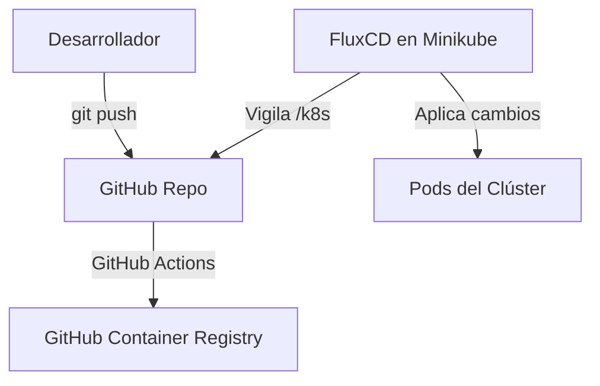

# Arquitectura e Infraestructura Local (InsuranceDemo)

Este documento detalla la configuración de la infraestructura local basada en Kubernetes (Minikube), la automatización de CI/CD, y la integración de GitOps (FluxCD) empleada en este proyecto.

---

## 1. Componentes del Clúster (Minikube)

La infraestructura local se ejecuta sobre un clúster dedicado en Minikube utilizando el controlador/driver de Docker Desktop.

* **Perfil del Clúster:** `insurance-demo`
* **Especificaciones:** 4 vCPUs, 4GB RAM (mínimo recomendado para desarrollo local).

### Componentes Internos
Todos los servicios se encuentran instalados en el namespace `default`:

* **PostgreSQL:** Desplegado mediante Helm (Chart de Bitnami).
  * **Nombre del servicio:** `my-postgres-postgresql`
  * **Base de datos inicial:** `insurance_db` (creada automáticamente).
* **Apache Kafka (KRaft):** Desplegado mediante Helm en modo KRaft (sin ZooKeeper) para reducir el consumo de recursos.
  * **Nombre del servicio:** `my-kafka`
  * **Réplicas:** 1 nodo controlador/broker (escala reducida para desarrollo local).
  * **Seguridad:** Protocolo `PLAINTEXT` (autenticación deshabilitada para simplificar las pruebas locales).
* **Ingress Controller (Nginx):** Addon interno de Minikube activado para enrutamiento.

---

## 2. Puertos de Desarrollo y Acceso Local

Para evitar conflictos con otros servicios locales que se ejecutan en tu PC (como bases de datos u otros servidores en WSL), se configuró un reenvío de puertos dedicado:

| Servicio | Puerto en Contenedor | Puerto Local (Host) | URL / Acceso |
| :--- | :--- | :--- | :--- |
| **PostgreSQL** | `5432` | `5433` | `localhost:5433` |
| **Angular Frontend** | `80` | `8081` | `http://localhost:8081` |
| **Spring Boot API** | `8080` | `8082` | `http://localhost:8082` |

---

## 3. Script de Automatización de Desarrollo

Para no abrir múltiples consolas, se creó un script unificado en la raíz del proyecto para abrir todos los túneles a la vez:

### Iniciar el Entorno
Ejecuta en PowerShell:
```powershell
.\run-dev.ps1
```
Este script limpia conexiones anteriores, levanta los reenvíos de puertos en segundo plano y se queda esperando.

### Detener el Entorno
* Presiona `Ctrl + C` en la terminal que ejecuta el script, o
* Cierra la ventana de la terminal.
* *El script interceptará el cierre y destruirá los túneles automáticamente.*

---

## 4. Ciclo GitOps (FluxCD) y CI/CD

El proyecto implementa prácticas modernas de GitOps mediante **FluxCD v2**.



1. **Compilación (CI):** Un push a la rama `main` en carpetas específicas (`Insurance-Backend/**` o `insurance-frontend/**`) activa el workflow en GitHub Actions que construye las imágenes Docker y las publica en **GitHub Container Registry (GHCR)** con visibilidad pública.
2. **Sincronización (CD):** **FluxCD** vigila la carpeta `/k8s` del repositorio remoto y aplica automáticamente cualquier cambio de configuración en el clúster de Minikube sin intervención manual.

---

## 5. Comandos para apagar y encender todo el clúster

### Apagar el Clúster
```powershell
minikube stop -p insurance-demo
```

### Encender el Clúster
1. Inicia Docker Desktop.
2. Ejecuta:
   ```powershell
   minikube start -p insurance-demo
   # Iniciar puertos de desarrollo
   .\run-dev.ps1
   ```
