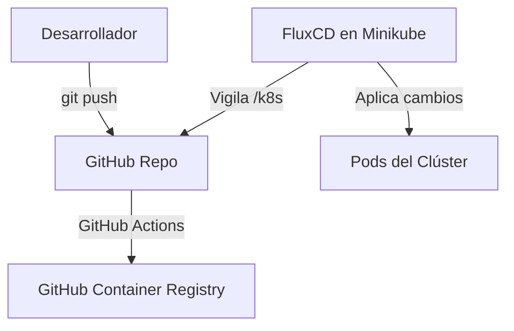

# Arquitectura e Infraestructura Local (InsuranceDemo)

Este documento detalla la configuración de la infraestructura local basada en Kubernetes (Minikube), la automatización de CI/CD, la integración de GitOps (FluxCD), y la exposición temporal a internet (Cloudflare Tunnel) empleada en este proyecto.

---

## 1. Componentes del Clúster (Minikube)

La infraestructura local se ejecuta sobre un clúster dedicado en Minikube utilizando el controlador/driver de Docker Desktop.

* **Perfil del Clúster:** `insurance-demo`
* **Especificaciones:** 4 vCPUs, 4GB RAM (mínimo recomendado para desarrollo local).

### Componentes Internos
Todos los servicios se encuentran instalados en el namespace `default`:

* **PostgreSQL:** Desplegado mediante Helm (Chart de Bitnami).
  * **Nombre del servicio:** `my-postgres-postgresql`
  * **Base de datos inicial:** `insurance_db` (creada automáticamente).
* **Apache Kafka (KRaft):** Desplegado mediante Helm en modo KRaft (sin ZooKeeper) para reducir el consumo de recursos.
  * **Nombre del servicio:** `my-kafka`
  * **Réplicas:** 1 nodo controlador/broker (escala reducida para desarrollo local).
  * **Seguridad:** Protocolo `PLAINTEXT` (autenticación deshabilitada para simplificar las pruebas locales).
* **Ingress Controller (Nginx):** Addon interno de Minikube activado para enrutamiento.

---

## 2. Puertos de Desarrollo y Acceso Local

Para evitar conflictos con otros servicios locales que se ejecutan en tu PC (como bases de datos u otros servidores en WSL), se configuró un reenvío de puertos dedicado:

| Servicio | Puerto en Contenedor | Puerto Local (Host) | URL / Acceso |
| :--- | :--- | :--- | :--- |
| **PostgreSQL** | `5432` | `5433` | `localhost:5433` |
| **Angular Frontend** | `80` | `8081` | `http://localhost:8081` |
| **Spring Boot API** | `8080` | `8082` | `http://localhost:8082` |

---

## 3. Script de Automatización de Desarrollo (Uso Local)

Para no abrir múltiples consolas, se creó un script unificado en la raíz del proyecto para abrir todos los túneles a la vez:

### Iniciar el Entorno Local
Ejecuta en PowerShell:
```powershell
.\run-dev.ps1
```
Este script limpia conexiones anteriores, levanta los reenvíos de puertos en segundo plano y se queda esperando.

### Detener el Entorno Local
* Presiona `Ctrl + C` en la terminal que ejecuta el script, o cierra la ventana de la terminal.
* *El script interceptará el cierre y destruirá los túneles automáticamente.*

---

## 4. Ciclo GitOps (FluxCD) y CI/CD

El proyecto implementa prácticas modernas de GitOps mediante **FluxCD v2**.



1. **Compilación (CI):** Un push a la rama `main` en carpetas específicas (`Insurance-Backend/**` o `insurance-frontend/**`) activa el workflow en GitHub Actions que construye las imágenes Docker y las publica en **GitHub Container Registry (GHCR)** con visibilidad pública.
2. **Sincronización (CD):** **FluxCD** vigila la carpeta `/k8s` del repositorio remoto y aplica automáticamente cualquier cambio de configuración en el clúster de Minikube sin intervención manual.

---

## 5. Exposición a Internet Simplificada (Cloudflare Tunnel)

Para exponer de forma unificada toda tu aplicación (frontend + backend) a través de internet usando Cloudflare Tunnel y que se actualice sola mediante GitOps (FluxCD), puedes utilizar el script automatizado creado en la raíz:

### Iniciar la Exposición a Internet
Ejecuta en una consola de PowerShell con permisos apropiados:
```powershell
.\run-public-tunnel.ps1
```

**¿Qué hace este script de forma tolerante a errores?**
1. **Minikube check:** Verifica si Minikube está corriendo; si no es así, lo inicia con la configuración óptima (4 CPUs, 4GB RAM).
2. **Ingress controller:** Habilita el addon `ingress` de Minikube si no estuviese activo.
3. **Aplicación de cambios:** Ejecuta `kubectl apply -f k8s/` para forzar que todos los manifiestos locales estén en sincronía en el clúster.
4. **Health Check (Readiness):** Espera a que los pods de backend/frontend y el propio Ingress Controller estén completamente sanos (`Running` y `Ready`).
5. **Túnel de Minikube:** Inicia en segundo plano el túnel del Ingress Controller de Minikube y extrae de forma automática la URL interna.
6. **Cloudflare Tunnel:** Lanza el túnel rápido de Cloudflare apuntando a la URL del Ingress y lo mantiene activo en primer plano para mostrarte la URL pública de la demo (`https://xxxx.trycloudflare.com`).

### Detener la Demo Pública
* Presiona `Ctrl + C` en la terminal donde corre el script.
* El bloque de limpieza detendrá automáticamente el túnel interno de Minikube y liberará la URL pública.

---

## 6. Guía Rápida: Cómo apagar y encender TODO desde cero

### Cómo Apagar Todo (Fin de jornada)
1. Si tienes el script `run-dev.ps1` o la demo de Cloudflare abiertos, ciérralos con `Ctrl + C` o cierra las terminales.
2. Apaga el clúster de Minikube:
   ```powershell
   minikube stop -p insurance-demo
   ```
3. Cierra Docker Desktop.

### Cómo Encender Todo de nuevo
1. Abre **Docker Desktop**.
2. Enciende el clúster de Kubernetes:
   ```powershell
   minikube start -p insurance-demo
   ```
3. Verifica que todo esté sano (`Running`):
   ```powershell
   kubectl get pods
   ```
4. **Si vas a programar en local:** Ejecuta `.\run-dev.ps1`.
5. **Si vas a hacer una demo a internet:** Sigue los pasos de la **Sección 5** (Cloudflare Tunnel).
