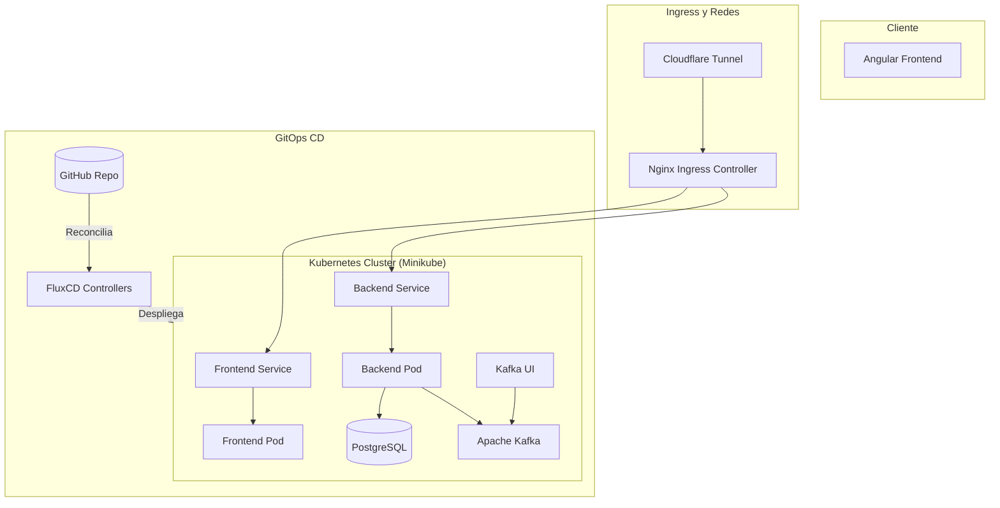

# 🛡️ Sofka Insure — Sistema de Gestión de Pólizas de Seguros

Sistema empresarial seguro de alto rendimiento para la cotización, emisión, control y auditoría de pólizas de seguros en tiempo real. Construido siguiendo los principios de la **Arquitectura Hexagonal**, **SOLID**, **Clean Code**, **GitOps** y aplicando **seis patrones de diseño** de manera coherente.

---

## 🛠️ Stack Tecnológico


---

## 📐 Arquitectura del Sistema

El sistema se basa en **Arquitectura Hexagonal (Ports & Adapters)** para desacoplar el núcleo de negocio de las tecnologías externas.



### Capas del Backend (Hexágono)
1. **Domain (Core del Negocio):** Contiene entidades puras, Value Objects, excepciones de dominio, puertos de interfaces (`ports`), estrategias, estados y fábricas. **Libre de dependencias de frameworks.**
2. **Application (Casos de Uso):** Coordina y ejecuta las reglas de negocio e interactúa con el dominio utilizando Inversión de Dependencias (DIP).
3. **Infrastructure (Adaptadores):** Implementa las interfaces de comunicación con el exterior (Base de datos JPA, Web Controllers, consumidores/publicadores de Kafka).

---

## ⚡ Guía de Arranque Rápido

### A. Ejecución en Local (Docker Compose)
1. **Levantar Infraestructura:**
   ```bash
   docker-compose up -d
   ```
   *Levanta PostgreSQL, Kafka con autenticación SASL PLAIN y Kafka-UI.*

2. **Ejecutar Backend:**
   ```bash
   cd Insurance-Backend
   ./mvnw spring-boot:run
   ```
   *Asegúrate de que tu `.env` tenga las credenciales para la base de datos y Kafka.*

3. **Ejecutar Frontend:**
   ```bash
   cd insurance-frontend
   pnpm install
   pnpm run start
   ```

### B. Ejecución en Kubernetes con Túnel Público (Recomendado)
Automatiza la inicialización de Minikube, habilita el Ingress, aplica manifiestos locales, verifica servicios y expone el clúster a internet:
```powershell
.\run-public-tunnel.ps1
```
*Copia la URL `.trycloudflare.com` que imprime la terminal para acceder desde cualquier dispositivo.*

---

## 🎨 Patrones de Diseño Aplicados (Módulo `policies`)

| Patrón | Propósito en el Dominio | Archivos Clave |
| :--- | :--- | :--- |
| **Factory Method** | Encapsula la creación de coberturas y primas base según el ramo (`AUTO`, `LIFE`, `HOME`, `HEALTH`). | [PolicyFactoryPort.java](file:///c:/Users/G_Laptop/InsuranceDemo/Insurance-Backend/src/main/java/edu/softkau/dev/insurancebackend/policy/domain/ports/PolicyFactoryPort.java) |
| **Strategy** | Algoritmos dinámicos e intercambiables para calcular la prima final (`STANDARD`, `RISK_BASED`, `LOYALTY`). | [RatingStrategyPort.java](file:///c:/Users/G_Laptop/InsuranceDemo/Insurance-Backend/src/main/java/edu/softkau/dev/insurancebackend/policy/domain/ports/RatingStrategyPort.java) |
| **Builder** | Creación y validación fluida y segura paso a paso del agregado complejo `Policy`. | [Policy.java](file:///c:/Users/G_Laptop/InsuranceDemo/Insurance-Backend/src/main/java/edu/softkau/dev/insurancebackend/policy/domain/model/Policy.java) |
| **State** | Controla las transiciones permitidas en el ciclo de vida de la póliza (`QUOTED`, `ISSUED`, `ACTIVE`, etc.). | [PolicyStatePort.java](file:///c:/Users/G_Laptop/InsuranceDemo/Insurance-Backend/src/main/java/edu/softkau/dev/insurancebackend/policy/domain/states/PolicyStatePort.java) |
| **Observer** | Publicación asíncrona de eventos a Kafka y reacción desacoplada de consumidores (Notificaciones/Auditoría). | [KafkaEventPublisher.java](file:///c:/Users/G_Laptop/InsuranceDemo/Insurance-Backend/src/main/java/edu/softkau/dev/insurancebackend/policy/infraestructure/adapters/messaging/KafkaEventPublisher.java) |
| **Singleton** | Garantiza un secuenciador de números de póliza único y seguro entre hilos (Thread-Safe) en memoria. | [PolicyNumberSequencer.java](file:///c:/Users/G_Laptop/InsuranceDemo/Insurance-Backend/src/main/java/edu/softkau/dev/insurancebackend/policy/domain/model/PolicyNumberSequencer.java) |

---

## 🔎 Caso de Estudio: Patrón Singleton

### ¿Por qué se requiere en este recurso?
La creación de pólizas exige asignar un número de póliza consecutivo único e inmutable (p. ej., `POL-2026-000001`, `POL-2026-000002`). Para evitar colisiones de números duplicados o saltos numéricos en concurrencia (*Race Conditions*), existe un único punto de verdad en memoria encargado de incrementar de manera atómica la secuencia: `PolicyNumberSequencer`.

### Implementación Bill Pugh Singleton (Thread-Safe)
Garantizamos la unicidad a través del patrón *Initialization-on-demand holder*:
```java
public class PolicyNumberSequencer {
    private final AtomicInteger counter;

    private PolicyNumberSequencer() {
        this.counter = new AtomicInteger(0);
    }

    private static class SingletonHolder {
        private static final PolicyNumberSequencer INSTANCE = new PolicyNumberSequencer();
    }

    public static PolicyNumberSequencer getInstance() {
        return SingletonHolder.INSTANCE;
    }
}
```
* **Constructor Privado:** Previene la creación externa con `new`.
* **Carga bajo demanda (Lazy-Loading):** La clase `SingletonHolder` no se carga hasta que se invoca `getInstance()`.
* **Sincronización Nativa JVM:** La JVM garantiza de forma atómica y segura frente a hilos la creación de la instancia única sin requerir costosos bloques `synchronized`.

### Mitigación de Desventajas vs Singleton del Contenedor (DI)
El singleton clásico acopla el código globalmente dificultando los mocks en pruebas unitarias. 
* **Mitigación:** Incorporamos un método `reset()` invocado en el `@BeforeEach` de los tests para garantizar aislamiento.
* **Alternativa de Producción:** En entornos empresariales reales con Spring, se prefiere delegar el ciclo de vida del secuenciador al contenedor IoC como un **Spring Bean** (con Scope Singleton predeterminado). Esto respeta el Principio de Inversión de Dependencias (DIP), simplifica los mockups (`@MockBean`) y permite inyectar el componente limpiamente.

---

## 🤖 Operaciones GitOps con FluxCD

El despliegue está automatizado de forma continua (CD) mediante GitOps:
1. Al realizar un `git push` a `main`, FluxCD reconcilia los recursos aplicando los cambios en el clúster.
2. Contamos con **Image Update Automation** de Flux:
   * **`ImageRepository`** escanea periódicamente el registro de contenedores de GitHub (GHCR).
   * **`ImagePolicy`** selecciona el tag más reciente que cumpla con el estándar semver (ej. `v1.0.x`).
   * **`ImageUpdateAutomation`** escribe el nuevo tag directamente en el código de [deployment.yaml](file:///c:/Users/G_Laptop/InsuranceDemo/k8s/deployment.yaml) de vuelta en GitHub, ejecutando la actualización rodante (*Rolling Update*) sin intervención humana.
